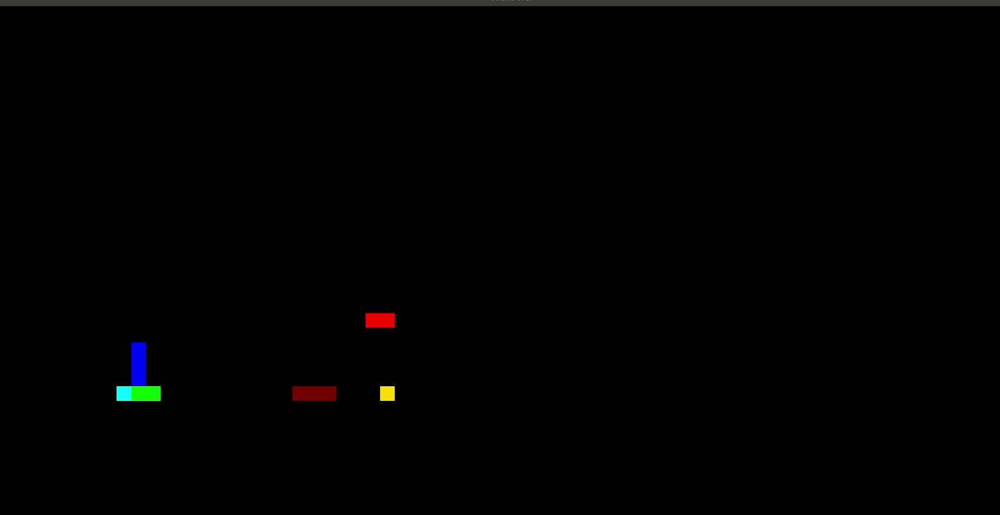

# SnakeWar game engine for AI

The Snake game has become a popular case study of AI topics and this project provides an engine that validates and presents all games in the multiplayer environment, giving the student the possibility to focus only on the game resolution algorithm

A simple "player" function is already provided for testing

To create a "player" code all you have to do is write your algorithm in a function that receives all the game data and returns with the game decision

## How to write a snake player

All it takes to create a "player" is to write a method with the following signature:

    Spin SnakeBase::play (cartesian _resolution, cartesian _target, std::list <SnakeBase *> snakes)

**_resolution** maintain the size of the board

**_target** holds the target (people use names like 'apple', 'gold', etc ... let's use the generic name 'target' for this)

**_list \<SnakeBase>** a list of snakes
(the snake itself is nothing more than a list of Cartesians representing its bdy)

**(Spin)** class in return is just a specialization of the class Direction that keeps the four possible Cartesian directions in an operable representation

Cartesian and direction was built to operate together, resulting that: Cartesian + Direction = target Cartesian

## Architecture

As the problem suggests, the central architecture is based on cartesian and directional components, operated by classes called "Cartesian" and "Direction" in the source code. Those two components provide all the necessary resources to represent and operate all game data  
The Direction class represents the "player" decision and operates over a Cartesian position  The change of direction is validated and there are operators to add (+) Cartesian and Directions and calculate the distance (%) between two given Cartesians
This is the development version but already theres SDL and NCurses based views
